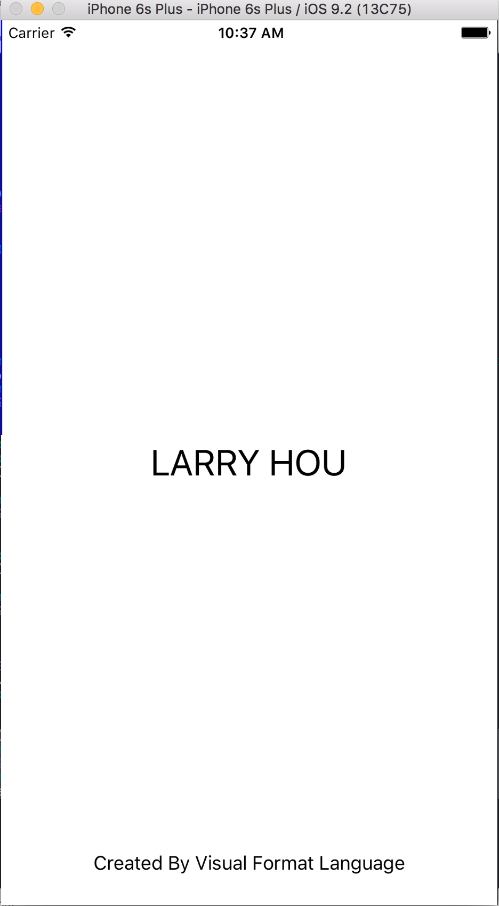

# Swift Examples

I was trying to learn swift and to find some swift examples to learn from.  And currently(2016), as Swift is too young, many examples online are for objective-c. And most examples of swift are too difficult for beginners.

This one original from https://github.com/larryhou/swift is so far the best one I can find. But it is from swift 1. I do not know how to contribute to the original fork(maybe later  I would merge mine to it. For now I would just build in my own account.

## Auto Layout

## AVprogramming

bug unfixed in photoviewcontroller.swift. line 127-143

## Byte Array

## Locate Me

## Photo Preview

## Simple TableView

## Video Player

Thanks to
[Sample Video](http://www.sample-videos.com "Sample Video").

